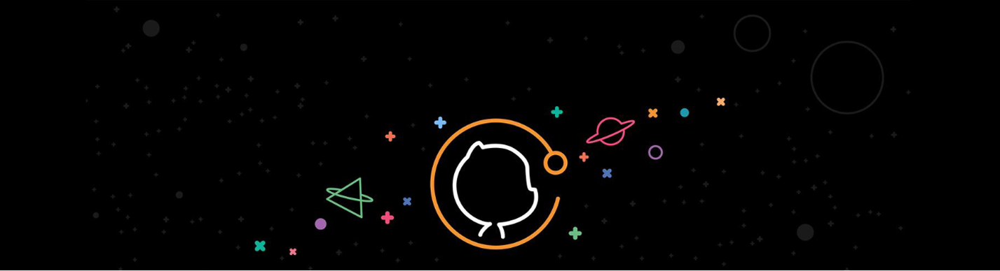

# Hi everyone 👋 I'm Iván 😁

> [!IMPORTANT]
> Content table.
> 1. [Aboute me](#about-me).
> 2. Stacks [Stacks](#stacks)
> 3. [Connect wwith me 😁](#Connect-with-me)

## Aboute me
Soy un desarrollador apasionado por la tecnología, el software libre y el aprendizaje constante. Me encanta crear soluciones que impacten positivamente a las personas.

## Stacks

## Connect with me

<!--
**IvanMendozaL/IvanMendozaL** is a ✨ _special_ ✨ repository because its `README.md` (this file) appears on your GitHub profile.

Here are some ideas to get you started:

- 🔭 I’m currently working on ...
- 🌱 I’m currently learning ...
- 👯 I’m looking to collaborate on ...
- 🤔 I’m looking for help with ...
- 💬 Ask me about ...
- 📫 How to reach me: ...
- 😄 Pronouns: ...
- ⚡ Fun fact: ...
-->
