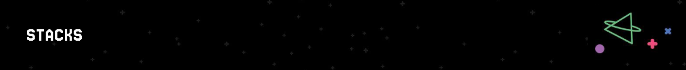
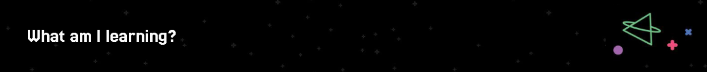
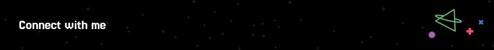

# Hi everyone 👋 I'm Iván 😁

> [!IMPORTANT]
> Content table.
> 1. [Aboute me](#about-me).
> 2. [Stacks](#stacks)
> 3. [What am I learning? 🧠](#Connect-with-me)
> 4. [Connect wwith me 😁](#Connect-with-me)

## Aboute me

My name is Iván Mendoza, and I'm passionate about learning about computer science and software development. I strongly believe in the importance of self-teaching, and it's good to always be on the lookout for new tools, technologies, and creative ways to solve problems. Every line of code is an opportunity to learn something new and continue growing, both professionally and personally. 💻😁

## Stacks

- 🔭 Languages: JavaScript, PHP, Dart
- 🛠️ Frameworks: Laravel, React, Flutter
- 🧰 Tools: Docker, Git, Vite

## What am I learning?

- Mobile development with Flutter
- Principles of clean architecture
- Automation with Docker

## Connect with me

- LinkedIn: [TuPerfil](https://www.linkedin.com/in/iv%C3%A1n-mendoza-565910201/)

Last Edited on: 26/05/2025

<!--
**IvanMendozaL/IvanMendozaL** is a ✨ _special_ ✨ repository because its `README.md` (this file) appears on your GitHub profile.

Here are some ideas to get you started:

- 🔭 I’m currently working on ...
- 🌱 I’m currently learning ...
- 👯 I’m looking to collaborate on ...
- 🤔 I’m looking for help with ...
- 💬 Ask me about ...
- 📫 How to reach me: ...
- 😄 Pronouns: ...
- ⚡ Fun fact: ...
-->
